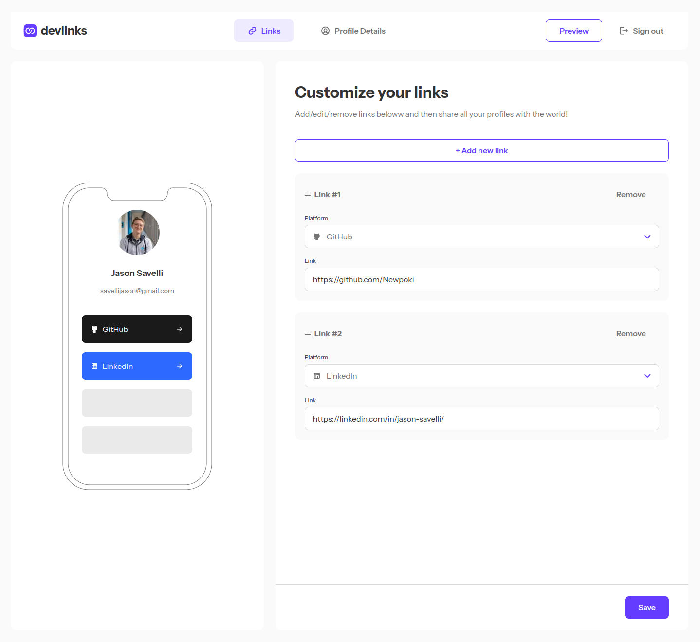

# Frontend Mentor - Link-sharing app solution

This is a solution to the [Link-sharing app challenge on Frontend Mentor](https://www.frontendmentor.io/challenges/linksharing-app-Fbt7yweGsT). Frontend Mentor challenges help you improve your coding skills by building realistic projects.

## Table of contents

-   [Setup](#setup)
-   [Overview](#overview)
    -   [The challenge](#the-challenge)
    -   [Screenshot](#screenshot)
    -   [Links](#links)
-   [My process](#my-process)
    -   [Built with](#built-with)
    -   [What I learned](#what-i-learned)
-   [Author](#author)

## Setup

-   `yarn`
-   Create `.env.local` file and fills variable that are shown in `.env.example`. **Make sure to use DEV Providers credentials and databse credentials**
-   `yarn dev`

## Overview

### The challenge

Users should be able to:

-   Create, read, update, delete links and see previews in the mobile mockup
-   Receive validations if the links form is submitted without a URL or with the wrong URL pattern for the platform
-   Drag and drop links to reorder them
-   Add profile details like profile picture, first name, last name, and email
-   Receive validations if the profile details form is saved with no first or last name
-   Preview their devlinks profile and copy the link to their clipboard
-   View the optimal layout for the interface depending on their device's screen size
-   See hover and focus states for all interactive elements on the page
-   **Bonus**: Save details to a database (build the project as a full-stack app)
-   **Bonus**: Create an account and log in (add user authentication to the full-stack app)

### Screenshot

### Links

-   Solution URL: [https://www.frontendmentor.io/solutions/fullstack-devlinks-app-with-next-ts-react-hook-form-zod-shadcn-5hwHPQb1bP](https://www.frontendmentor.io/solutions/fullstack-devlinks-app-with-next-ts-react-hook-form-zod-shadcn-5hwHPQb1bP)
-   Live Site URL: [https://devlinks-tan.vercel.app/](https://devlinks-tan.vercel.app/)

## My process

### Built with

-   [NextJS](https://nextjs.org/) - React framework
-   [Shadcn](https://ui.shadcn.com/) - UI library component
-   [Tailwind](https://tailwindcss.com/) - CSS utilities
-   [React hook form](https://react-hook-form.com/) - React hook form
-   [Next Auth](https://next-auth.js.org/) - Authentication framework

### What I learned

-   How to setup a project using `next-auth`
-   Using react hook form with Next

## Author

-   Website - [Jason savelli](https://jasonsavelli.fr)
-   Frontend Mentor - [@Newpoki](https://www.frontendmentor.io/profile/Newpoki)
